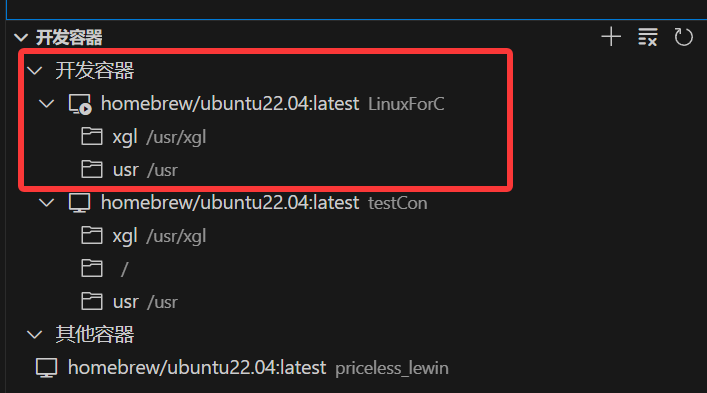
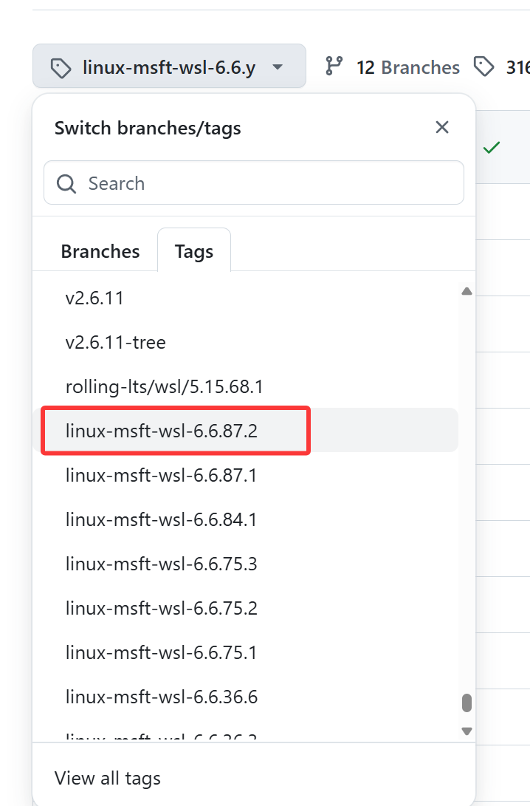

# 
 linux内核模块学习 </centor>
## 准备工作
	说明：是基于windows wsl2内核的linux内核模块学习
1.安装docker desktop  使用云存档的镜像 homebrew/ubuntu22.04 创建特权容器 不然某些功能受到限制，比如插入ko

    执行：
    docker run -it --privileged  --name LinuxForC -u root  homebrew/ubuntu22.04:latest /bin/bash

2.以管理员权限打开powershell 更新wsl2内核

    执行：
    wsl.exe --update

3.下载vscode 并下载remote-ssh插件 链接刚刚创建的docker容器 点击即可链接

4.docker容器内执行uname-a 查看内核版本

5.前往微软的wsl内核仓 找到名称相同的tag后，下载到本地; 此时vscode已经链接容器 可以直接拖入
    
    内核仓链接：https://github.com/microsoft/WSL2-Linux-Kernel.git

6. 编译内核前 还需下载部分依赖工具
   
   apt update
   apt upgrade
   apt install build-essential libelf-dev bison flex libssl-dev libncurses-dev bc git cpio dwarves python3 kmod

7.解压缩下载的内核压缩包 如果是git clone 则切换到对应的分支

    解压缩: unzip WSL2-Linux-Kernel-linux-msft-wsl-6.6.87.2.zip
    git clone: git checkout linux-msft-wsl-6.6.87.2

    然后
    进入对应文件夹:cd WSL2-Linux-Kernel-linux-msft-wsl-6.6.87.2
    执行编译命令: make KCONFIG_CONFIG=Microsoft/config-wsl
等待编译完成即可

## hello.ko

参照教程编写的简易入门的ko 由于是特权容器 这里可以执行插入ko的命令 并通过dmesg -w看到打印

    此时的用于编译的内核路径应被指定为: /usr/xgl/WSL2-Linux-Kernel-linux-msft-wsl-6.6.87.2

    注：
        1.打印的末尾应加上换行符，否则可能出现预期之外的结果
        2.打印中文字符会出现乱码，应尽量避免

添加了简易的时间打印模块 并通过dmesg -w命令查看打印

    在Makefile中 可以通过ccflags-y 添加依赖的库文件